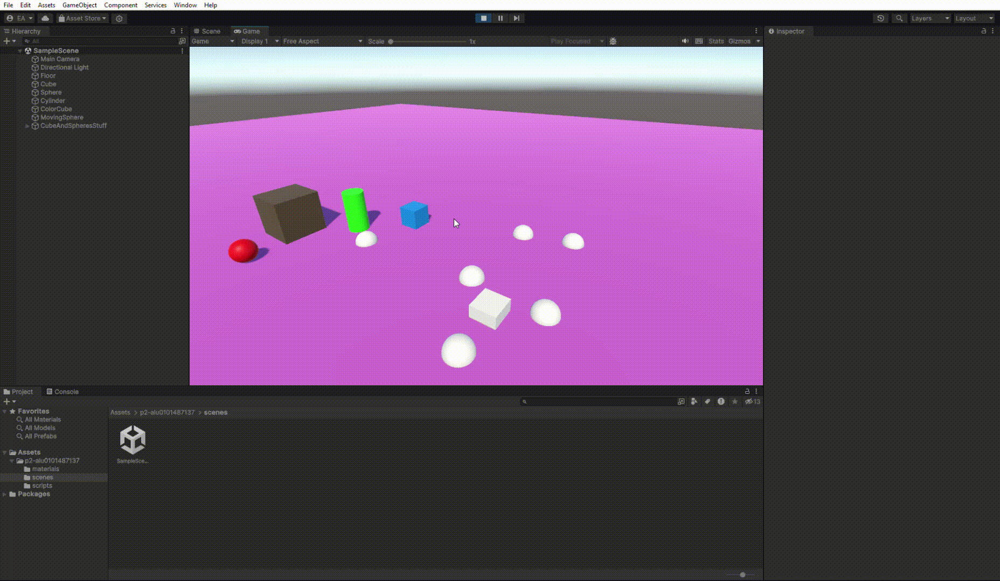

# Interfaces Inteligentes Práctica 2

*Elías Hernández Abreu - alu0101487137@ull.edu.es*

Los resultados de las operaciones de los ejercicios se imprimen en la consola en la función Ready():

Al pulsar la tecla ESPACIO una esfera cambia entre 3 posiciones y las esferas de los grupos hacen su respectivo trabajo.

Al pulsar C el cilindro cambia de color.

Al pulsar FLECHA ARRIBA el cubo cambia de color.
